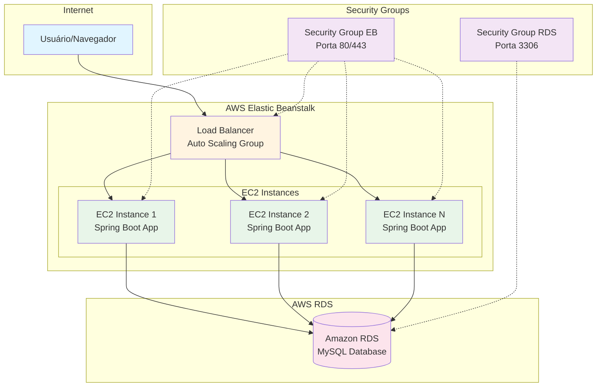

+++
title = "LAB 12 - Deploy na AWS com Elastic Beanstalk e RDS"
description = "Tutorial passo a passo para fazer o deploy da aplicação Spring Boot na AWS usando Elastic Beanstalk via console web, com configuração automática de RDS e suporte a H2DB para desenvolvimento local."
date = 2026-05-14
draft = false
author = "Enoque Leal"
tags = [ "aws", "elastic-beanstalk", "rds", "spring-boot", "deploy", "cloud" ]
mermaid = true
+++

## 🎯 Objetivo

Neste laboratório vamos fazer o deploy da aplicação **carstore-spring-boot** na AWS usando o **Elastic Beanstalk**. O Elastic Beanstalk é um serviço gerenciado que facilita o deploy de aplicações web, automaticamente provisionando recursos como load balancers, Auto Scaling groups e bancos de dados.

O deploy será realizado através do **console web** da AWS, e configuraremos a aplicação para:
- Usar **H2DB** em ambiente de desenvolvimento local;
- Usar **RDS (Amazon Relational Database Service)** automaticamente provisionado pelo Elastic Beanstalk em produção.

Ao final você deverá saber:

- Criar uma aplicação no Elastic Beanstalk via console web;
- Configurar o ambiente para incluir um banco de dados RDS;
- Ajustar o `application.properties` para suportar múltiplos ambientes (local e AWS);
- Fazer o upload do JAR da aplicação e monitorar o deploy;
- Acessar a aplicação rodando na AWS.

## Pré-requisitos

- Ter acesso a AWS Academy ou ter uma conta da AWS ativa;
- Ter completado os laboratórios anteriores (especialmente LAB 7 - integração com banco);
- Projeto **carstore-spring-boot** compilando localmente;
- Ter o JAR da aplicação pronto (`mvn clean package`);
- Conhecimento básico sobre serviços da AWS.

---

## Checklist Pré-Deploy

Antes de começar, verifique se você possui:

- JAR da aplicação foi gerado com sucesso: `target/carstore-spring-boot-*.jar` existe?
- Arquivo `application-aws.properties` foi criado em `src/main/resources/`?
- Caso você não tenha essas dependências no seu pom.xml, basta adicionar conforme exemplo:
  ```xml
  <dependency>
      <groupId>com.mysql</groupId>
      <artifactId>mysql-connector-j</artifactId>
      <scope>runtime</scope>
  </dependency>
  
  <dependency>
      <groupId>org.springframework.boot</groupId>
      <artifactId>spring-boot-starter-actuator</artifactId>
  </dependency>
  ```

---

## Arquitetura do Ambiente Elastic Beanstalk

A seguir, apresentamos a estrutura que será criada na AWS quando configurarmos o ambiente do Elastic Beanstalk com RDS:



**Componentes provisionados automaticamente:**

- **Load Balancer**: Distribui o tráfego entre as instâncias EC2
- **Auto Scaling Group**: Gerencia automaticamente o número de instâncias EC2
- **EC2 Instances**: Servidores onde a aplicação Spring Boot roda
- **RDS Instance**: Banco de dados MySQL gerenciado
- **Security Groups**: Regras de firewall para controlar o acesso
- **VPC**: Rede virtual isolada na AWS

---

## Contrato (curto)

- Entrada: JAR da aplicação Spring Boot configurado para ambientes múltiplos;
- Saída: Aplicação rodando na AWS com banco de dados RDS provisionado automaticamente;
- Erros: falhas no deploy são visíveis no console do Elastic Beanstalk (logs, eventos);
- Critério de sucesso: aplicação acessível via URL do Elastic Beanstalk, persistindo dados no RDS.

## Panorama das alterações (arquivos-chave)

- `src/main/resources/application.properties` - configuração para múltiplos ambientes;
- `src/main/resources/application-aws.properties` - configuração específica para AWS;
- `target/carstore-spring-boot-*.jar` - artefato gerado pelo Maven para deploy.

---

## Tarefa 1: Preparando o projeto para múltiplos ambientes

### Parte 1: Configuração local (H2DB)

Vamos manter a configuração atual para desenvolvimento local. Abra o arquivo `src/main/resources/application.properties` e mantenha as configurações do H2:

```properties
# Configuração local - H2DB
spring.datasource.url=jdbc:h2:~/test;AUTO_SERVER=TRUE
spring.datasource.driverClassName=org.h2.Driver
spring.datasource.username=sa
spring.datasource.password=sa

spring.h2.console.enabled=true
spring.h2.console.path=/h2-console

spring.jpa.hibernate.ddl-auto=update
spring.jpa.show-sql=true
```

### Parte 2: Configuração AWS (RDS)

Crie um novo arquivo chamado `application-aws.properties` no diretório `src/main/resources/`. Este arquivo será usado automaticamente quando a aplicação rodar no Elastic Beanstalk:

```properties
# Configuração AWS - RDS (MySQL)
# Estas variáveis de ambiente devem ser configuradas no Elastic Beanstalk
spring.datasource.url=jdbc:mysql://${RDS_HOSTNAME}:3306/${RDS_DB_NAME}?useSSL=false&serverTimezone=UTC&allowPublicKeyRetrieval=true
spring.datasource.username=${RDS_USERNAME}
spring.datasource.password=${RDS_PASSWORD}
spring.datasource.driver-class-name=com.mysql.cj.jdbc.Driver

# JPA configuração para produção
spring.jpa.hibernate.ddl-auto=update
spring.jpa.show-sql=false
spring.jpa.properties.hibernate.dialect=org.hibernate.dialect.MySQLDialect

# Desabilitar H2 console em produção
spring.h2.console.enabled=false
```

> **Nota**: As variáveis de ambiente `RDS_HOSTNAME`, `RDS_USERNAME`, `RDS_PASSWORD` e `RDS_DB_NAME` devem ser configuradas no Elastic Beanstalk. Embora a documentação da AWS diga que elas são criadas automaticamente, na prática (especialmente em contas AWS Academy Sandbox) isso pode não funcionar. Verifique e configure manualmente se necessário (veja Tarefa 10).
>
> **IMPORTANTE - MySQL 8.0+**: O parâmetro `allowPublicKeyRetrieval=true` é OBRIGATÓRIO para MySQL 8.0+ (incluindo a versão 8.4.8 usada neste laboratório). O MySQL 8.0+ usa o método de autenticação `caching_sha2_password` que requer este parâmetro para funcionar corretamente com o driver JDBC. Sem ele, você receberá o erro: "Public Key Retrieval is not allowed".
>
> **Variáveis necessárias (para este laboratório):**
> - `RDS_HOSTNAME`: Endpoint do banco de dados RDS (ex: `awseb-e-xxxxx-stack-awsebrdsdatabase-xxxxx.xxxx.us-east-1.rds.amazonaws.com`) - **Cada aluno terá um endpoint diferente**
> - `RDS_DB_NAME`: `ebdb` (nome padrão do banco criado pelo Elastic Beanstalk)
> - `RDS_USERNAME`: `carstore` (usuário mestre configurado na criação)
> - `RDS_PASSWORD`: `carstore123*` (senha configurada na criação)
>
> **Importante**: Usamos porta fixa `3306` em vez de `${RDS_PORT}` pois o Elastic Beanstalk pode não injetar esta variável consistentemente. MySQL sempre usa porta 3306.

### Parte 3: Adicionar dependência do MySQL

Como o RDS padrão do Elastic Beanstalk usa MySQL, precisamos adicionar confirmar se temos a dependência do driver MySQL no `pom.xml`:

```xml
<dependency>
    <groupId>com.mysql</groupId>
    <artifactId>mysql-connector-j</artifactId>
    <scope>runtime</scope>
</dependency>
```

> Caso ainda não tenha adicionado, adicione esta dependência dentro da seção `<dependencies>` do seu `pom.xml`.

**Adicionalmente**, se o seu projeto ainda não tiver o **Spring Boot Actuator**, adicione também esta dependência (necessária para os endpoints de health check configurados acima):

```xml
<dependency>
    <groupId>org.springframework.boot</groupId>
    <artifactId>spring-boot-starter-actuator</artifactId>
</dependency>
```

> O Spring Boot Actuator fornece endpoints de monitoramento e gerenciamento, incluindo o endpoint `/actuator/health` usado pelo Elastic Beanstalk para verificar se a aplicação está saudável.

### Parte 4: Configurações específicas para Elastic Beanstalk

Para garantir que a aplicação funcione corretamente no Elastic Beanstalk, adicione as seguintes configurações no arquivo `application-aws.properties`:

```properties
# Configuração de porta (Elastic Beanstalk usa porta 8080 por padrão)
server.port=${PORT:8080}

# Configuração de contexto (opcional - use root context)
server.servlet.context-path=/

# Configuração de encoding e timezone
server.servlet.encoding.charset=UTF-8
server.servlet.encoding.enabled=true
server.servlet.encoding.force=true
spring.jackson.time-zone=UTC

# Configuração de health check (importante para Elastic Beanstalk)
management.endpoints.web.exposure.include=health,info,metrics
management.endpoint.health.show-details=when-authorized

# Configuração de logging para produção
logging.level.root=INFO
logging.level.org.springframework.web=INFO
logging.level.org.hibernate=INFO
logging.pattern.console=%d{yyyy-MM-dd HH:mm:ss} - %msg%n

# Configuração de compressão (opcional - melhora performance)
server.compression.enabled=true
server.compression.mime-types=application/json,application/xml,text/html,text/xml,text/plain
```

> **Importante sobre Health Check**: O Elastic Beanstalk verifica se a aplicação está saudável fazendo requisições ao endpoint `/`. Se sua aplicação Spring Boot Security proteger a rota `/`, você pode precisar configurar o health check ou ajustar as regras de segurança.

> **Nota sobre porta**: O Elastic Beanstalk usa nginx como proxy reverso na porta 80 (HTTP) e 443 (HTTPS), e encaminha as requisições para a aplicação na porta 8080. A variável de ambiente `PORT` será configurada automaticamente. Esta configuração é padrão e geralmente não precisa ser alterada.

### Parte 5: Configurar o profile ativo (CRÍTICO)

A variável de ambiente `SPRING_PROFILES_ACTIVE=aws` é **OBRIGATÓRIA** para ativar o arquivo `application-aws.properties`. 

**Se esta variável não for configurada**:
- A aplicação usará as configurações de H2 do `application.properties`
- A aplicação tentará conectar a um banco H2 local que não existe no servidor
- Resultado: erro de conexão e aplicação fora do ar

O Elastic Beanstalk não ativa automaticamente o profile correto. Você **DEVE** adicionar essa variável manualmente nas Environment Properties (veja Tarefa 6, seção "Environment Properties").

---

## Tarefa 2: Gerando o JAR para deploy

### Parte 1: Build do projeto

Execute o comando Maven para gerar o JAR da aplicação:

```bash
mvn clean package -DskipTests
```

Este comando irá:
- Limpar builds anteriores (`clean`);
- Compilar o projeto e gerar o JAR (`package`);
- Pular testes (`-DskipTests`) para agilizar o processo.

### Parte 2: Localizar o JAR

Após o build, o JAR estará disponível em:

`
target/carstore-spring-boot-<version>.jar
`

Anote o caminho completo deste arquivo, pois será necessário na etapa de upload.

---

## Tarefa 3: Criando o ambiente no Elastic Beanstalk (Wizard Web)

O processo de criação do ambiente no Elastic Beanstalk agora segue um wizard de 5 passos. Vamos configurar cada passo conforme nossa necessidade.

### Parte 1: Acessar o console da AWS

1. Faça login no [Console da AWS](https://console.aws.amazon.com/);
2. Na barra de busca, digite "Elastic Beanstalk" e selecione o serviço;
3. Clique em "Create environment" (o wizard será iniciado diretamente).

---

## Tarefa 4: Configurando o Step 1 - Configure environment Info

No primeiro passo do wizard, configuramos as informações básicas do ambiente.

### Environment tier Info

Selecione o tipo de ambiente:

- **Environment tier**: Selecione **Web server environment** (para rodar nossa aplicação web que serve requisições HTTP)
- Deixe **Worker environment** desmarcado (usado para processamento em background)

### Application information Info

Preencha as informações da aplicação:

- **Application name**: `carstore-spring-boot` (máximo 100 caracteres)
- **Application tags**: (opcional) deixe vazio por enquanto

### Environment information Info

Configure as informações do ambiente:

- **Environment name**: `CarStore-prod` (4 a 40 caracteres, apenas letras, números e hífens)
- **Domain**: Deixe o padrão (ex: `.us-east-1.elasticbeanstalk.com`)
- Clique em "Check availability" para verificar disponibilidade
- **Environment description**: `Ambiente de produção da aplicação CarStore com RDS`

### Platform Info

Configure a plataforma da aplicação:

- **Platform**: Selecione **Java**
- **Platform branch**: Escolha **Java running on 64bit Amazon Linux 2023** (ou a versão mais recente disponível)
- **Platform version**: Deixe a versão mais recente selecionada

### Application code Info

Configure o código da aplicação:

- Selecione **Upload your code**
- Clique em "Choose file" e selecione o JAR gerado na Tarefa 2 (`target/carstore-spring-boot-*.jar`)
- Em "Version label", dê um nome para esta versão (ex: `v1.0.0`)

### Presets Info

Escolha a configuração preset:

- **Configuration presets**: Selecione **Single instance (free tier eligible)** para este laboratório
  - Esta opção é ideal para desenvolvimento e teste
  - Para produção, você pode escolher **High availability** posteriormente

> **Nota**: O preset "Custom configuration" remove os valores recomendados e usa os padrões do serviço. Para este laboratório, usaremos o preset de instância única.

Após preencher todas as configurações do Step 1, clique em **Next** para avançar para o Step 2.

---

## Tarefa 5: Configurando o Step 2 - Configure service access

Neste passo configuramos as permissões IAM necessárias para o Elastic Beanstalk gerenciar os recursos.

> **⚠️ Importante para contas AWS Academy Sandbox**: Em ambientes de laboratório da AWS Academy, os roles IAM são predefinidos e você não tem permissão para criar novos roles. Use os roles especificados abaixo.

### Service access Info

Configure os papéis IAM que permitem ao Elastic Beanstalk criar e gerenciar seu ambiente.

#### Service role

O Elastic Beanstalk precisa de um role de serviço para assumir e gerenciar recursos:

- **Service role**: Selecione **LabRole**
  - Este role é predefinido em contas AWS Academy Sandbox
  - Ele já possui as permissões IAM gerenciadas necessárias
  - Não tente criar um novo role, pois você não terá permissão
- O sistema mostrará "Service roles refreshed" quando atualizar

> **Nota**: O `LabRole` permite que o Elastic Beanstalk crie e gerencie instâncias EC2, Load Balancers, RDS e outros recursos em ambientes de laboratório.

#### EC2 instance profile

As instâncias EC2 precisam de um perfil de instância para realizar operações necessárias:

- **EC2 instance profile**: Selecione **LabInstanceProfile**
  - Este perfil é predefinido em contas AWS Academy Sandbox
  - Ele já permite que suas instâncias EC2 realizem operações necessárias
  - Não tente criar um novo perfil, pois você não terá permissão
- O sistema mostrará "EC2 instance profile refreshed" quando atualizar

> **Nota**: O `LabInstanceProfile` permite que as instâncias EC2 acessem logs, enviem métricas para CloudWatch, e outras operações essenciais.

#### EC2 key pair (opcional)

Para acesso SSH às instâncias EC2:

- **EC2 key pair**: Deixe em branco
  - Em contas AWS Academy Sandbox, geralmente não há key pairs configurados
  - Não teremos acesso SSH neste laboratório
  - Para produção em sua própria conta, é recomendado configurar para troubleshooting

> **Nota**: O key pair permite acesso seguro via SSH às instâncias EC2 para debug e manutenção. Em ambientes de laboratório, geralmente não é necessário.

Após configurar as permissões, clique em **Next** para avançar para o Step 3.

---

## Tarefa 6: Configurando o Step 3 - Set up networking, database, and tags

Este é o passo mais importante onde configuramos a rede e, principalmente, o banco de dados RDS.

### Instance settings

Configure as configurações de rede das instâncias.

#### VPC

- **VPC**: Deixe selecionado o valor padrão (`-`) que representa o VPC padrão da sua região
  - O Elastic Beanstalk usará o VPC padrão da sua conta na região selecionada
  - Se preferir, você pode clicar em **Create VPC** para criar um VPC personalizado

> **Nota**: O VPC (Virtual Private Cloud) é uma rede virtual isolada onde seus recursos AWS serão executados. Para este laboratório, usaremos o VPC padrão.

#### Public IP address

- **Public IP address**: Deixe **Enable** marcado
  - Isso atribui endereços IP públicos às instâncias EC2
  - Necessário para que as instâncias possam ser acessadas via Load Balancer

#### Instance subnets

- **Instance subnets**: Deixe as subnets padrão selecionadas
  - O Elastic Beanstalk selecionará automaticamente subnets em diferentes Availability Zones
  - Você verá informações de Availability Zone, Subnet, CIDR e Name para cada subnet

> **Nota**: Se não houver subnets configuradas, você pode criá-las no console VPC. Para este laboratório, as subnets padrão são suficientes.

---

### Database Info

Esta é a seção crucial onde configuramos o RDS automaticamente.

#### Enable database

- Marque a opção **Enable database** para integrar um banco de dados RDS ao ambiente
- Deixe **Restore a snapshot** desmarcado (usaremos um banco novo)

#### Database settings

Configure os parâmetros do banco de dados:

- **Engine**: Selecione **mysql** (MySQL)
- **Engine version**: Deixe a versão mais recente (ex: `8.0` ou superior)
- **Instance class**: Selecione **db.t3.micro** (Free Tier eligible em contas AWS Academy)
- **Storage**: Configure **20 GB** (suficiente para desenvolvimento e testes)
- **Username**: Digite `carstore` (username padrão para este laboratório)
  - ⚠️ **Importante**: Não use `admin` ou `root` como username, pois são usuários reservados
  - Use `carstore` como especificado para este laboratório
- **Password**: Digite `carstore123*` (senha padrão para este laboratório)
  - A senha deve ter no mínimo 8 caracteres
  - **Anote esta senha**: você precisará dela para configurar as variáveis de ambiente

#### Availability

- **Availability**: Selecione **Low (one AZ)** para este laboratório
  - Para produção, considere alta disponibilidade com múltiplas AZs

#### Database deletion policy

Configure o que acontece com o banco quando o ambiente for terminado:

- **Database deletion policy**: Selecione **Create snapshot**
  - Esta opção salva um snapshot do banco antes de deletá-lo
  - Você pode restaurar o banco a partir do snapshot posteriormente
  - Útil para não perder dados em caso de terminação acidental

> **Opções disponíveis**:
> - **Create snapshot**: Salva snapshot antes de deletar (recomendado)
> - **Retain**: O banco continua existindo fora do Elastic Beanstalk
> - **Delete**: O banco é completamente deletado sem backup

---

### Tags (opcional)

- **Tags**: Você pode adicionar até 50 tags para organizar e filtrar recursos
- Para este laboratório, deixe vazio
- Tags são pares key-value úteis para organização e custeamento

---

### Environment Properties (Importante para AWS Academy)

Configure as variáveis de ambiente necessárias para a aplicação funcionar corretamente:

- Clique em "Add property" para adicionar uma nova variável de ambiente
- Configure da seguinte forma:
  - **Source**: Plain text
  - **Name**: PORT
  - **Value**: 8080

- Clique em "Add property" novamente para adicionar outra variável:
  - **Source**: Plain text
  - **Name**: SPRING_PROFILES_ACTIVE
  - **Value**: aws

> **⚠️ Importante**: A variável de ambiente `PORT=8080` é necessária em contas AWS Academy Sandbox para garantir que a aplicação Spring Boot use a porta correta. Sem essa configuração, a aplicação pode não iniciar corretamente.
>
> **Nota**: A variável `SPRING_PROFILES_ACTIVE=aws` garante que o profile correto seja ativado para carregar as configurações do `application-aws.properties`.

**Sobre as variáveis RDS:**

A documentação da AWS diz que o Elastic Beanstalk cria automaticamente as variáveis `RDS_HOSTNAME`, `RDS_DB_NAME`, `RDS_USERNAME` e `RDS_PASSWORD` quando você configura um banco de dados acoplado. **Porém, na prática (especialmente em contas AWS Academy Sandbox), isso pode não funcionar.**

Após criar o ambiente, você DEVE verificar se essas variáveis foram criadas automaticamente:

1. No console do Elastic Beanstalk, vá em Configuration → Software → Environment properties
2. Verifique se as variáveis RDS estão presentes
3. **Se NÃO estiverem presentes**, você precisará adicioná-las manualmente:

Para obter os valores:
- Acesse o console RDS → Databases → clique na instância criada
- **RDS_HOSTNAME**: Copie o "Endpoint" (ex: `awseb-e-xxxxx-stack-awsebrdsdatabase-xxxxx.xxxx.us-east-1.rds.amazonaws.com`) - **Cada aluno terá um endpoint diferente**
- **RDS_DB_NAME**: `ebdb` (verifique em Configuration se for diferente)
- **RDS_USERNAME**: `carstore` (o username que você definiu no Step 3)
- **RDS_PASSWORD**: `carstore123*` (a senha que você definiu no Step 3)

Adicione estas variáveis manualmente no Environment Properties se elas não estiverem presentes.

Após configurar rede, banco de dados, tags e environment properties, clique em **Next** para avançar para o Step 4.

---

## Tarefa 7: Revisando e criando o ambiente (Step 4 e Step 5)

### Step 4 - Review (opcional)

Neste passo você pode revisar todas as configurações antes de criar o ambiente:

- Verifique todas as configurações dos passos anteriores
- Revise os custos estimados (se disponível)
- Se necessário, clique em **Edit** para voltar e ajustar configurações

**Configurações adicionais importantes para AWS Academy:**

Durante o review ou em uma etapa separada, verifique/ajuste as seguintes configurações:

1. **Health reporting**: Configure como **Basic**
   - Esta configuração determina a frequência e tipo de relatórios de saúde do ambiente
   - "Basic" é suficiente para ambientes de laboratório

2. **Managed updates**: Deixe **DESMARCADO**
   - Não habilite atualizações gerenciadas em ambientes AWS Academy Sandbox
   - Isso evita conflitos com as restrições da conta de laboratório

### Step 5 - Create

Após revisar tudo:

1. Clique em **Create environment** para iniciar a criação
2. O Elastic Beanstalk começará a provisionar todos os recursos:
   - Instâncias EC2
   - Security Groups
   - Instância RDS MySQL
   - Load Balancer (se configurado no preset)
   - VPC e subnets (se usando custom)

3. Você será redirecionado para a página do ambiente onde pode acompanhar o progresso

---

## Tarefa 8: Acompanhando o deploy

### Parte 1: Monitorar o progresso da criação

Após clicar em "Create environment", você será redirecionado para a página do ambiente. O processo de criação pode levar **5-15 minutos**.

1. Acompanhe o status do ambiente na parte superior da página:
   - **Launching**: Recursos estão sendo criados
   - **Updating**: Configurações estão sendo aplicadas
   - **Ready**: Ambiente está pronto para uso

2. Monitore a aba **Events** para ver o progresso detalhado:
   - Você verá mensagens sobre criação de EC2, RDS, Security Groups, etc.
   - Se houver erros, eles aparecerão aqui em vermelho

3. Acompanhe a aba **Health** para ver o status das instâncias:
   - **Severe**: Problemas críticos
   - **Degraded**: Problemas de performance
   - **Warning**: Avisos não críticos
   - **No Data**: Ainda não há dados suficientes
   - **Ok**: Tudo funcionando normalmente

### Parte 2: Verificar o status dos recursos

Você pode verificar individualmente os recursos criados:

1. **Instâncias EC2**:
   - No menu lateral, clique em "Instances"
   - Verifique se as instâncias estão rodando
   - Confirme se o status é "Running"

2. **Banco de dados RDS**:
   - No menu lateral, clique em "Configuration" -> "Database"
   - Verifique as informações do RDS criado
   - Confirme se o status é "Available"

3. **Security Groups**:
   - No console EC2, vá para "Security Groups"
   - Verifique os grupos criados pelo Elastic Beanstalk
   - Confirme as regras de entrada/saída

---

## Tarefa 9: Verificando o deploy

### Parte 1: Acessar a aplicação

Quando o ambiente estiver com status "Ready":

1. No console do Elastic Beanstalk, copie a URL do ambiente (ex: `http://carstore-prod.us-east-1.elasticbeanstalk.com`)
2. Abra esta URL no seu navegador
3. A aplicação deve carregar normalmente

### Parte 2: Testar a persistência de dados

1. Crie um novo carro através da interface web
2. Verifique se o carro foi criado com sucesso
3. Atualize a página ou acesse de outro navegador para confirmar que os dados persistiram (indicando que o RDS está funcionando)

### Parte 3: Verificar logs (se necessário)

Se houver problemas, você pode verificar os logs:

1. No menu lateral do ambiente, clique em "Logs"
2. Clique em "Request logs" -> "Last 100 lines"
3. Procure por erros ou mensagens de startup da aplicação
4. Você também pode fazer "Full logs" para baixar logs completos

---

## Tarefa 10: Gerenciando variáveis de ambiente (IMPORTANTE)

### Parte 1: Acessar configurações do ambiente

1. No menu lateral do ambiente, clique em "Configuration"
2. Role até a seção "Software"
3. Clique em "Edit"

### Parte 2: Verificar variáveis de ambiente RDS (CRÍTICO)

**⚠️ IMPORTANTE**: Embora a documentação da AWS diga que o Elastic Beanstalk cria automaticamente as variáveis RDS, na prática isso pode não funcionar (especialmente em contas AWS Academy Sandbox).

Verifique se as seguintes variáveis de ambiente estão presentes:

`RDS_HOSTNAME=<endpoint-do-rds>`

`RDS_DB_NAME=ebdb`

`RDS_USERNAME=carstore`

`RDS_PASSWORD=carstore123*`

**Se as variáveis NÃO estiverem presentes:**

1. Acesse o console RDS → Databases → clique na instância criada pelo Elastic Beanstalk
2. Copie as informações necessárias:
   - **Endpoint**: Para `RDS_HOSTNAME` (ex: `awseb-e-xxxxx-stack-awsebrdsdatabase-xxxxx.xxxx.us-east-1.rds.amazonaws.com`) - **Cada aluno terá um endpoint diferente**
   - **Database name**: Para `RDS_DB_NAME` (deve ser `ebdb`)
3. Volte para o Elastic Beanstalk → Configuration → Software → Edit
4. Adicione manualmente as variáveis faltantes:
   - **Name**: `RDS_HOSTNAME`, **Value**: cole o endpoint copiado do console RDS
   - **Name**: `RDS_DB_NAME`, **Value**: `ebdb`
   - **Name**: `RDS_USERNAME`, **Value**: `carstore`
   - **Name**: `RDS_PASSWORD`, **Value**: `carstore123*`
5. Clique em "Apply" para salvar
6. O ambiente será reiniciado automaticamente

> **Nota**: O `RDS_USERNAME` para este laboratório é `carstore` (conforme definido no Step 3).
>
> **Nota**: Se as variáveis não forem configuradas manualmente quando necessário, a aplicação falhará ao iniciar com erro "Communications link failure".

### Parte 3: Adicionar variáveis personalizadas (opcional)

Se precisar adicionar outras variáveis de ambiente:

1. Em "Environment properties", clique em "Add property"
2. Defina o nome e valor da propriedade
3. Clique em "Apply" para salvar as alterações
4. O ambiente será reiniciado automaticamente

Exemplos de variáveis úteis:
- `SPRING_PROFILES_ACTIVE=aws` (para ativar profile específico)
- `LOG_LEVEL=INFO` (para configurar nível de log)
- Variáveis de configuração específicas da sua aplicação

---

## Tarefa 11: Acessando o RDS diretamente (opcional)

### Parte 1: Encontrar o endpoint do RDS

1. No console da AWS, vá para o serviço "RDS"
2. Clique em "Databases" no menu lateral
3. Você verá a instância RDS criada pelo Elastic Beanstalk
4. Clique na instância para ver os detalhes
5. Copie o "Endpoint" (algo como `carstore.xxxx.us-east-1.rds.amazonaws.com`)

### Parte 2: Conectar via cliente MySQL

Se você tiver um cliente MySQL (MySQL Workbench, DBeaver, etc.):

1. Use o endpoint copiado como host
2. Use a porta `3306`
3. Use o username `carstore` e password `carstore123*` (definidos no Step 3)
4. Conecte-se para verificar as tabelas e dados criados pela aplicação

> **Nota**: Para conectar externamente, você precisa garantir que o Security Group do RDS permite sua conexão. Por padrão, o Elastic Beanstalk restringe o acesso ao RDS apenas para as instâncias EC2 do ambiente.

---

## Conclusão

Neste laboratório você aprendeu a:

- Configurar uma aplicação Spring Boot para múltiplos ambientes (local e AWS);
- Usar o Elastic Beanstalk para deploy simplificado na AWS;
- Provisionar automaticamente um banco de dados RDS;
- Fazer deploy via console web da AWS;

Esta configuração permite que você desenvolva localmente com H2DB (rápido e simples) e faça deploy em produção com RDS (robusto e escalável), sem precisar alterar código - apenas configurações.

---

Parabéns! 🎉

Você concluiu o LAB 12 e agora sabe como fazer o deploy da sua aplicação Spring Boot na AWS usando Elastic Beanstalk com RDS!
